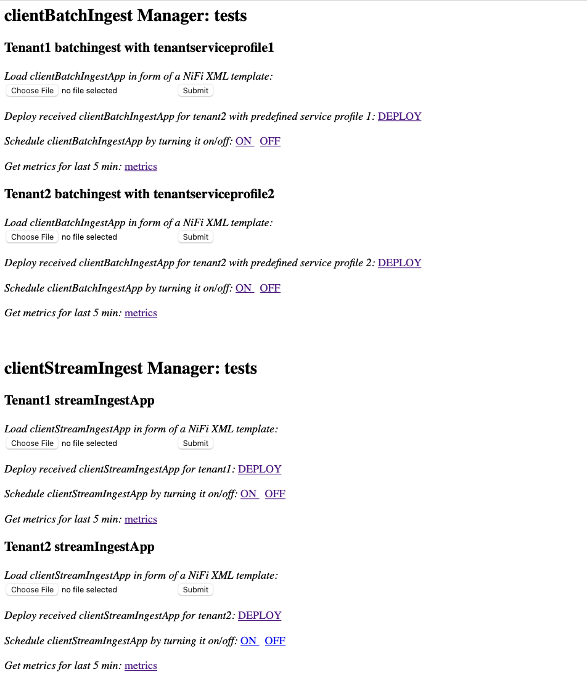
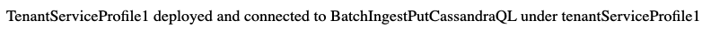
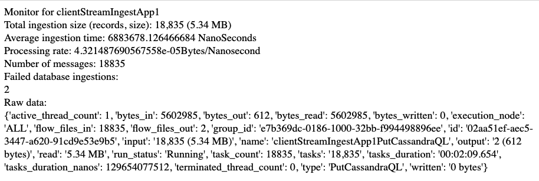

## Deploy and Set Up Apache Cassandra Cluster
### Deploy Cassandra Cluster in Docker
It is expected that Docker is installed on the system. 

In terminal cd into .../code and execute
`docker-compose up`

When the cluster sets up, get their container ids with 
`docker ps` and enter one of them with 
`docker exec -it <containerID> bash`

### Configure the Cluster
Enter CQL with `cqlsh` then create the needed keyspace for a tenant with
```
CREATE KEYSPACE tenant1
  WITH REPLICATION = {
  'class' : 'SimpleStrategy',
  'replication_factor' : 2
  };
```

```
CREATE KEYSPACE tenant2
  WITH REPLICATION = {
  'class' : 'SimpleStrategy',
  'replication_factor' : 2
  };
```

Then create table into the keyspace for our data with 
```
CREATE TABLE tenant1.ddata (
time text,
readable_time timestamp,
acceleration float,
acceleration_x int,
acceleration_y int,
acceleration_z int,
battery int,
humidity float,
pressure float,
temperature float,
dev_id text,
PRIMARY KEY (dev_id, readable_time));
```
```
CREATE TABLE tenant2.ddata (
time text,
readable_time timestamp,
acceleration float,
acceleration_x int,
acceleration_y int,
acceleration_z int,
battery int,
humidity float,
pressure float,
temperature float,
dev_id text,
PRIMARY KEY (dev_id, readable_time));
```
after that our nifi cluster is set ready to receive data from clientApps deployed under their service profiles.


## Deploy and Confugure Apache NiFi
### Deploy NiFi in a Docker Container

In terminal pull latest Apache NiFi container: `docker pull apache/nifi:latest`


Deploy the container with
```
docker run -p 8080:8080 -d \
-e NIFI_WEB_HTTP_HOST="0.0.0.0" \
-e NIFI_WEB_HTTP_PORT="8080" \
-e NIFI_WEB_HTTPS_PORT="" \
-e NIFI_WEB_PROXY_CONTEXT_PATH="/" \
-e NIFI_WEB_PROXY_HOST="" \
-e NIFI_WEB_PROXY_PORT="" \
-e NIFI_WEB_SECURITY_ENABLED="false" \
--network="code_default" --name nifii \
-e JVM_HEAP_SIZE=8g \
apache/nifi:1.17.0
```
This will deploy a single node nifi container (if you want to try out a 3-node nifi cluster use the yml file for it in /code. We give the nifi extra heap, for better logging. Note that we wet the network to the docker network of the cassandra cluter, by default it will be called "code_default". Makse sure that the containers have beend deployed to the same network with:

`docker ps --format '{{ .ID }} {{ .Names }} {{ json .Networks }}'`

go to [http://localhost:8080/nifi](http://localhost:8080/nifi) to see the web interface No login credentials are needed.

## Deploy the clientAppsManager Driver with Monitoring Features and Testing Web Interface
### Build Container Image for clientManagers Driver
Cd into `/code/clientManagersDriver` and build the application:

`docker build -t clientAppsManager .`

Again, make sure that it gets deployed on the correct network.

### Deploy the driver
`docker run -p 5050:5050  --network="code_default" clientAppsManager`

### Test the Driver with the Tester Web Interface
Access the Tester Web Interface on [http://localhost:5050/](http://localhost:5050/)

<p align="center">
  
With this tester interface, you can deploy clientApps automatically, schedule them to start and stop ingestion and receive metrics. 
  
The clientBatchIngestApp Monitor returns raw metrics data json plus information about failed ingestions. 
  
The clientStreamIngestApp Monitor return refined (calculated) metrics as well as information on failed ingestions.
  
#### Deploy clientApps & get metrics
Drag and drop any client App from `/code/clientApps` the web interface will confirm the receive. In order to deploy client's app, press deploy.
  
<p align="center">
  
If you go to Apache Nifi web interface, you will see, that tenant's app has been deployed:

<p align="center">
  
The client Batch/Stream IngestManager will automatically set the apps to their service prfiles.

Try scheduling the apps ON and OFF. Click "metrics" to receive metrics from the Monitor.
<p align="center">

Monitor for streamClientIngestApp:


  
  
In order to test out streaming apps, you can deploy in Nifi an MQTT client that will publish data to the MQTT Broker, (upload Nifi template from `/code/clientApps/MQTTpublisherSimulator.xml` and turn it on), from which clientStreamIngestApps will receive their data.
