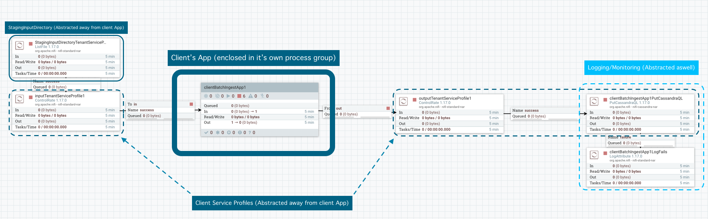

# 1 - Batch data ingestion pipeline 

### 1.1 The ingestion will be applied to files of data. Define a set of constraints for files that mysimbdp will support for ingestion. Design a configuration model for the tenant service profile that can be used to specify a set of constraints for ingestion (e.g., maximum number of files and amount of data). Explain why you as a platform provider decide such constraints. Implement these constraints into simple configuration files and provide examples (e.g., JSON or YAML)

Service profile is defined in two .xml files for input and ouptut of the clientBatchIngestApp, One limits the number of files (per hour) and file extension that can be accepted and forwarded into clientBatchIngestApp, the other sets a constraint on size of data per hour that is allowed for ingestion from clientBatchIngestApp to the database. As a service platform provider we want to have control over disk access in StagingInputDirectory and reads, we also want to differentiate the client services based on their pay, for example tenant1 pays little and tenant2 pays alot for his service, this comes at a for mysimbdp, therefore we want to limit the amount of files and data that each tenant can process, depending on their service profile. Cheching file format and limiting uploadrates can also provide some safety to the system. 

For testing for each tenant (two tenants) a personal batch ingestion service profile has been developed, the first one limits user to stage 500 files of any format for ingestion per-hour and 1 Gigabyte per-hour, the second one limits user to stage 500 .csv files for ingestion per-hour and 100 Gigabytes per-hour. It is also possible to limit the file size:
```
<entry>
<key>Maximum File Size</key>
  <value>1 GB</value>
</entry>
```
The service profile also restricts clients to writing data in fields that do not belong to them.

#### TenantServiceProfile2:
inputTenantServiceProfile2:
```
<entry>
<key>File Filter</key>
  <value>[^\.].*.csv</value>
</entry>
...
<entry>
<key>Maximum Rate</key>
  <value>500</value>
</entry>
<entry>
<key>Rate Controlled Attribute</key>
</entry>
<entry>
<key>Time Duration</key>
  <value>1 h</value>
</entry>
```

outputTenantServiceProfile2:
```
...
<entry>
<key>Cassandra Contact Points</key>
  <value>cassandra-1:9042,cassandra-2:9042,cassanra-3:9042</value>
</entry>
<entry>
<key>Keyspace</key>
  <value>tenant2</value>
</entry>
...
<entry>
<key>Rate Control Criteria</key>
  <value>data rate</value>
</entry>
<entry>
<key>Maximum Rate</key>
  <value>100 GB</value>
</entry>
<entry>
<key>Rate Controlled Attribute</key>
</entry>
<entry>
<key>Time Duration</key>
  <value>1 h</value>
</entry>
...

```
Whenever a clientBatchIngestApp is deployed, these profiles are assigned to it as rateControllers (thus controlling & limiting the throughput of a pipeline accordingly to tenant's service profile)

### 1.2 Each tenant will put the tenant's data files to be ingested into a staging directory, client-staging- input-directory within mysimbdp (the staging directory is managed by the platform). Each tenant provides its ingestion programs/pipelines, clientbatchingestapp, which will take the tenant's files as input, in client-staging-input-directory, and ingest the files into mysimbdp-coredms. Any clientbatchingestapp must perform at least one type of data wrangling to transform data elements in files to another structure for ingestion. As a tenant, explain the design of clientbatchingestapp and provide one implementation. Note that clientbatchingestapp follows the guideline of mysimbdp given in the next Point 3.

In mysimbdp, a clientBatchIngestApp is an enclosed Nifi process group with one input and one output port. These ports connect at input to StagingInputDirectory (under their service plan constraints) and at output to the controlled database ingester (output is also controlled with service constraints). This provides a layer of enclosure to the customers application, having a remote process group can provide even more, but here it is done locally. Inside tenant's process group a tenant is free process files as they desire. In my case each tenant simply receives files from the clientStagingDirectory, then reads them and "wrangles" the data to build a cql insert statement. Outside clientBatchIngestApp the statement will only be accepted if the keyspace belongs to the tenant and datawrites per hor are not exceeded. Outside nifi, whenever a new clientBatchingestApp is created an abstratction of it is stored in manager. The abstraction (in form of a python calss) keeps track of the application id's and backup files.

<p align="center">
  

