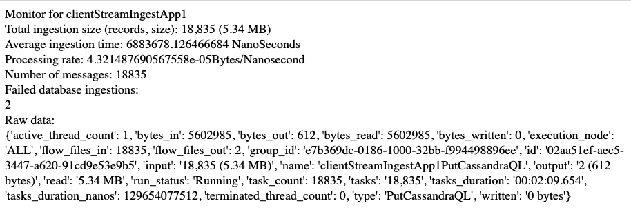

<p align="center">

# 1 - Batch data ingestion pipeline 

### 1.1 The ingestion will be applied to files of data. Define a set of constraints for files that mysimbdp will support for ingestion. Design a configuration model for the tenant service profile that can be used to specify a set of constraints for ingestion (e.g., maximum number of files and amount of data). Explain why you as a platform provider decide such constraints. Implement these constraints into simple configuration files and provide examples (e.g., JSON or YAML)

Service profile is defined in two .xml files for input and ouptut of the clientBatchIngestApp, One limits the number of files (per hour) and file extension that can be accepted and forwarded into clientBatchIngestApp, the other sets a constraint on size of data per hour that is allowed for ingestion from clientBatchIngestApp to the database. As a service platform provider we want to have control over disk access in StagingInputDirectory and reads, we also want to differentiate the client services based on their pay, for example tenant1 pays little and tenant2 pays alot for his service, this comes at a for mysimbdp, therefore we want to limit the amount of files and data that each tenant can process, depending on their service profile. Cheching file format and limiting uploadrates can also provide some safety to the system. 

For testing for each tenant (two tenants) a personal batch ingestion service profile has been developed, the first one limits user to stage 500 files of any format for ingestion per-hour and 1 Gigabyte per-hour, the second one limits user to stage 500 .csv files for ingestion per-hour and 100 Gigabytes per-hour. It is also possible to limit the file size:
```
<entry>
<key>Maximum File Size</key>
  <value>1 GB</value>
</entry>
```
The service profile also restricts clients to writing data in fields that do not belong to them.

#### TenantServiceProfile2:
inputTenantServiceProfile2:
```
<entry>
<key>File Filter</key>
  <value>[^\.].*.csv</value>
</entry>
...
<entry>
<key>Maximum Rate</key>
  <value>500</value>
</entry>
<entry>
<key>Rate Controlled Attribute</key>
</entry>
<entry>
<key>Time Duration</key>
  <value>1 h</value>
</entry>
```

outputTenantServiceProfile2:
```
...
<entry>
<key>Cassandra Contact Points</key>
  <value>cassandra-1:9042,cassandra-2:9042,cassanra-3:9042</value>
</entry>
<entry>
<key>Keyspace</key>
  <value>tenant2</value>
</entry>
...
<entry>
<key>Rate Control Criteria</key>
  <value>data rate</value>
</entry>
<entry>
<key>Maximum Rate</key>
  <value>100 GB</value>
</entry>
<entry>
<key>Rate Controlled Attribute</key>
</entry>
<entry>
<key>Time Duration</key>
  <value>1 h</value>
</entry>
...

```
Whenever a clientBatchIngestApp is deployed, these profiles are assigned to it as rateControllers (thus controlling & limiting the throughput of a pipeline accordingly to tenant's service profile)

### 1.2 Each tenant will put the tenant's data files to be ingested into a staging directory, client-staging- input-directory within mysimbdp (the staging directory is managed by the platform). Each tenant provides its ingestion programs/pipelines, clientbatchingestapp, which will take the tenant's files as input, in client-staging-input-directory, and ingest the files into mysimbdp-coredms. Any clientbatchingestapp must perform at least one type of data wrangling to transform data elements in files to another structure for ingestion. As a tenant, explain the design of clientbatchingestapp and provide one implementation. Note that clientbatchingestapp follows the guideline of mysimbdp given in the next Point 3.

In mysimbdp, a clientBatchIngestApp is an enclosed Nifi process group with one input and one output port. These ports connect at input to StagingInputDirectory (under their service plan constraints) and at output to the controlled database ingester (output is also controlled with service constraints). This provides a layer of enclosure to the customers application, having a remote process group can provide even more, but here it is done locally. Inside tenant's process group a tenant is free process files as they desire. This way the apps are essentially "black boxes" but still controllable and with constraints to what they can do.

In my case each tenant simply receives files from the clientStagingDirectory, then reads them and "wrangles" the data to build a cql insert statement. Outside clientBatchIngestApp the statement will only be accepted if the keyspace belongs to the tenant and datawrites per hor are not exceeded. Outside nifi, whenever a new clientBatchingestApp is created an abstratction of it is stored in manager (clientBatchIngestManager). The abstraction (in form of a python calss) keeps track of the application id and backup file the class also receives the pre defined serviceprofile, when it gets passed from the driver to the manager.

<p align="center">
  
clientApps get deployed automatically and get scheduled through Nifi's API. This is handled by the clientBatchIngestManager.
  
### 1.3 As the mysimbdp provider, design and implement a component mysimbdp-batchingestmanager that invokes tenant's clientbatchingestapp to perform the ingestion for available files in client- staging-input-directory. mysimbdp imposes the model that clientbatchingestapp has to follow but clientbatchingestapp is, in principle, a blackbox to mysimbdp-batchingestmanager. Explain how mysimbdp-batchingestmanager knows the list of clientbatchingestapp and decides/schedules the execution of clientbatchingestapp for tenants.
  
clientBatchIngestManager is defined as a python object which keeps a list of clientBatchIngestApps and deploys, controls and monitors them over Nifi API. The manager requires a driver for it so physically it runs on a flask app container. The driver provides scheduling logic and a web interface for it & for its monitor. The driver also drives streamIngestManager (part 2). Please see clientbatchingestappmanager.py and driver: app.py. The code is well commented.

Whenever a new clientBatchIngestApp is deployed (they can only be deployed through the manager, invoked by the driver) the manager receives an abstraction of the clientBatchINgest app and stores it. It uses the abstraction to deploy, schedule and retrieve metrics (through the API) from the actual application running on Nifi.
  
The scheduling logic for the manager is defined in the driver. I have set it to schedule all batchIngestApplications running whenever the load on the mysimbdp is low, i.e. more than 50% streamIngestApplications are underperforming (more than 50% of stream apps processing less than 100 messages per hour). Additionally by default the streamBatchIngestApplications are scheduled to run at night, when the load on servers is expected to be lower. For testing purpoces i have commented it out of the code, please uncomment them if you want to test that feature.
  
For the driver (app.py, which runs the managers) I have developed a web interface that makes testing and monitoring easier. Please read the Deployment instructions to see how to do the tests.

  
### 1.4 Explain your design for the multi-tenancy model in mysimbdp: which parts of mysimbdp will be shared for all tenants, which parts will be dedicated for individual tenants so that you as a platform provider can add and remove tenants based on the principle of pay-per-use. Develop test clientbatchingestapp, test data, and test constraints of files, and test service profiles for tenants according your deployment. Show the performance of ingestion tests, including failures and exceptions, for at least 2 different tenants in your test environment and constraints. Demonstrate examples in which data will not be ingested due to a violation of constraints. Present and discuss the maximum amount of data per second you can ingest in your tests.
  
  
While explaining the previous parts i have already touched the aspect of accessible parts of mysimbdp. In essence, each clientBatchIngestApp can access (in real deployment) their own clientStagingInputDirectory, read files from it under their service profile specifications, and write data out (again, under their service profile specifications) only to their keyspace in cassandra cluster. The tenants applications simply will not receive file, if it violates the constraints and if data limit is exceded, the data will not be put into the database. If a clientBatchIngestApp tries to write to a keyspace not belonging to it, the data will be dropped as well as if data is in wrong format. The service profiles are configuresd in nifi controlRate -blocks outside the clientBatchIngestApplication, so it has no control over them. The service will simply not allow applications to violate the service.
  
For example, clientapp with service profile 1 has sent 1 GB of data for last 1 h, the service profile will not allow it to send any more data, so the data will be kept in a queue. after an hour passes after the ingestion started the queue will  be emptied for exactly 1 GB / h. Or for example clientapp has read 500 files for last hour, it willnot be allowed to read more (by the service) and when an hour passes, the queued files will be  be passed to it.
  
Testing max data performance with apps running for 5 minutes the statistics shown in 1.5 "Batch Ingest Monitor with 2 apps writing data for 5 mins" were received. So with a rough calculation 15 MB * 2 / ( 5 * 60) = 1 MB/s, which is bad. (I had hard time running the tests on my laptop, for some reason docker would not free up it's VM's memory out of ram for some reason, so this is all i have got. I wish i had time to do benchmarks on cloud) The test environment had 1-node Nifi cluster.
  
### 1.5 Implement and provide logging features for capturing successful/failed ingestion as well as metrics about ingestion time, data size, etc., for files which have been ingested into mysimbdp. Logging information must be stored in separate files, databases or a monitoring system for analytics of ingestion. Explain how mysimbdp could use such logging information. Show and explain simple statistical data extracted from logs for individual tenants and for the whole platform with your tests.
  
Additionally to managing the clientBatchIngestApps the clientBatchIngestManager also retrieves Logs from them (though API). The service attaches LogAtribute processor to the end of the pipeline, to keep track of possible failed ingestions, it also retrieves information from the endpoint of the pipeline to keep track of ingestion time, data writes, speed, size etc. provided by the json. The monitoring system fuctionality is implemented in the driver, and can be accessed through it's web interface or with a http request. The data is updated with a moving 5-minute window, which is updated every nanosecond.
  
<p align="center">
  
This data is especially interesting to the service provider, for example this data can be retrieved by a load balancer application, that will deploy another Nifi node or a Cassandra node to their clusters when it calculates that the pipeline / ingestion processing rate drops below a threshold, some threshold level.

Below is data for two clientBatchIngestApps ingesting data for 5 minutes (from the start, so some time went for processing inside applications, before infegestion itself) Screenshot taken from driver's web interfaces showing metrics.

<p align="center">

***<p align="center">Batch Ingest Monitor with 2 apps writing data for 5 mins</p>***

## 2 - Near-realtime data ingestion
  
### 2.1 Tenants will put their data into messages and send the messages to a messaging system, mysimbdp- messagingsystem (provisioned by mysimbdp) and tenants will develop ingestion programs, clientstreamingestapp, which read data from the messaging system and ingest the data into mysimbdp-coredms. For near-realtime ingestion, explain your design for the multi-tenancy model in mysimbdp: which parts of the mysimbdp will be shared for all tenants, which parts will be dedicated for individual tenants so that mysimbdp can add and remove tenants based on the principle of pay- per-use. The MQTT receiver is external to the clientStreamIngestApp and managed by service, so that clientApps will not be able to read wrong data. Additional security can be provided by adding client users with their own passwords and usernames in the MQTT borker.

It is expected that Each client has an external MQTT client (MQTT was desided to be used, since the data is IoT data from a korkeassaari Zoo, so MQTT protocol is more desirable). Any client will publish their data to their topics & subtopics. 

For simplicity i have developed a simple emulator as a nifi flow, that publishes data to MQTT broker on a single topic /data. clientStreamIngestApps receive this data and build a cql insert statement and for ward it to their output port. The data from it will be ingested into the database to their own keyspace, in same manner as explained in part 1.
  
clientStreamIngestApp is also its own process group that is physically running on Nifi. It also has an abstraction object, that stores the id of the clientapp and abchup file. These abstraction objects are passed to the manager to control clientapps and keep track of them by from the manager. (Similarly as in part 1)
  

### 2.2 Design and implement a component mysimbdp-streamingestmanager, which can start and stop clientstreamingestapp instances on-demand. mysimbdp imposes the model that clientstreamingestapp has to follow so that mysimbdp-streamingestmanager can invoke clientstreamingestapp as a blackbox, explain the model.

streamIngestManager is defined as a python object which keeps a list of clientStreamIngestApps and deploys, controls and monitors them over Nifi API. The manager requires a driver (the same thing as mentioned in part 1) for it so physically it runs on a flask app container. The driver provides a web interface for it & for its monitor. Please see clientstreamingestappmanager.py and driver: app.py.

Whenever a new clientStreamIngestApp is deployed (they can only be deployed through the manager, invoked by the driver) the manager receives an abstraction of the clientStreamIngest app and stores it. It uses the abstraction to deploy, schedule and retrieve metrics (through the API) from the actual application pipeline running on Nifi.

### 2.3 Develop test ingestion programs (clientstreamingestapp), which must include one type of data wrangling (transforming the received message to a new structure). Show the performance of ingestion tests, including failures and exceptions, for at least 2 different tenants in your test environment, explain also the data used for testing. What is the maximum throughput of the ingestion in your tests?
  
The clientStreaimIngestApp 1 and 2 simply receive data and wrangle it by building cql instert statement. The service will only allow it to write in tenant's own keyspace, othervise it will drop it. It also has to be in correct format, for example in the tests monior reports that there is one failed ingestion in both client apps, this is caused by a wrong data format in the CQL insert statement. Failed ingestion is logged.

The data used is the same data as in part 1, IoT data from Korkeasaari zoo. The data is produced by MQTT client emulator discussed in 2.1.
  
<p align="center">
  
According to this data retrieved from two simultaneously running clientStreamIngestApps the maximum throughput is 2x 80.3 records/s or in size 2x 22.5 kBps. There was also a MQTT publisher running on the same Nifi node. The test environment had 1-node Nifi cluster. 
  
### 2.4 clientstreamingestapp decides to report the its processing rate, including average ingestion time, total ingestion data size, and number of messages to mysimbdp-streamingestmonitor within a pre- defined period of time. Design the report format and explain possible components, flows and the mechanism for reporting.
  
The reporting is done through Nifi's API, in similar manner as in part 1. The report is a collection of JSON files (2 of them) one catches failed ingestions from LogAttribute processor attached to the end of the pipeline and the other retrieves data from the end of the pipeline to keep trak of listed parameters (average ingestion time, total ingestion data size, and number of messages) that are calculated from JSON. The data is updated with a moving 5-minute window, which is updated every nanosecond.

### 2.5 Implement a feature in mysimbdp-streamingestmonitor to receive the report from clientstreamingestapp. Based on the report from clientstreamingestapp, when the performance is below a threshold, e.g., average ingestion time is too low, mysimbdp-streamingestmonitor decides to inform mysimbdp-streamingestmanager about the situation. Implementation a feature in mysimbdp-streamingestmanager to receive information informed by mysimbdp- streamingestmonitor. 

The monitor itself can be read in the driver's web interface or data can be requested with a http -request.
  
The driver provides monitor that retrieves the data. Whenever data is requested, metrics are calculated by the manager. The driver runs a scheduled task every 5 minutes (within manager) and keeps track of the underperforming client apps. The monitor itself can be read in the driver's web interface or requested with a http -request.

<p align="center">
  
# 3 - ntegration and Extension

### 3.1 Produce an integrated architecture for the logging and monitoring of both batch and near-realtime ingestion features (Part 1, Point 5 and Part 2, Points 4-5) so that you as a platform provider could know the amount of data ingested and existing errors/performance for individual tenants. 

I have actually done this, as i saw it more logical for managers to be running on the same driver. So from the clientManagersDriver it is possible to request and monitor in real time data for each tenant and each application.

### 3.2 In the stream ingestion pipeline, assume that a tenant has to ingest the same data but to different sinks, e.g., mybdp-coredms for storage and a new mybdp-streamdataprocessing component, what features/solutions you can provide and recommend to your tenant?

In this case i would provide a special service for the tenant allowing him to have "two client application" running and one having more than one output port, one of which connecting the two applications together in a pipeline.
  

### 3.3 The tenant wants to protect the data during the ingestion by using some encryption mechanisms to encrypt data in files. Thus, clientbatchingestapp has to deal with encrypted data. Which features/solutions you recommend the tenants and which services you might support them for this goal?
  
The tenant would have to add to his batchIngestApp an additional component at the input, that will decrypt the contents of a file. For example this can be done with EncyptContent -processor. The data can also be re encrypted, once the client app has been done processing. and forward encrypted data to the sink. So this does require anything from the service provider, only from the tenant.

### 3.4  In the case of near-realtime ingestion, we want to (i) detect the quality of data to allow ingestion only for data with a pre-defined quality of data condition and (ii) store metadata, including detected quality, into the platform, how would you suggest a design/change of your design for achieving this?
  
Assuming that the data is coming from IoT applications, the application could include RSSI (Received Signal Strength Indicator) and SNR (Signal to Noise Ratio) in the payload, to then support possible data corruption assessment in metadata. Then if we know how much data has been dropped (dropped packets, or information from MQTT broker about dropped messages, e.g. if we are useng lower quality of service) as well as failed ingestions due to some reason, we can add that metadata to some time ranges, indicating that this data has lower "time resolution" this kind of metadata could be stored for example in additional table created for it.
  
  
### 3.5 If a tenant has multiple clientbatchingestapp, each is suitable for a type of data and has different workloads, such as complex transformation or feature engineering (e.g., different CPUs, memory consumption and execution time), how would you extend your design and implementation in Part 1 (only explain the concept/design) to support this requirement? 

In this case, we would need to have different service profiles for each application under one tenant. We would have to modify the driver to accept that. Additionally, will require for tenant to have multiple different tables in coredms under his keyspace.
